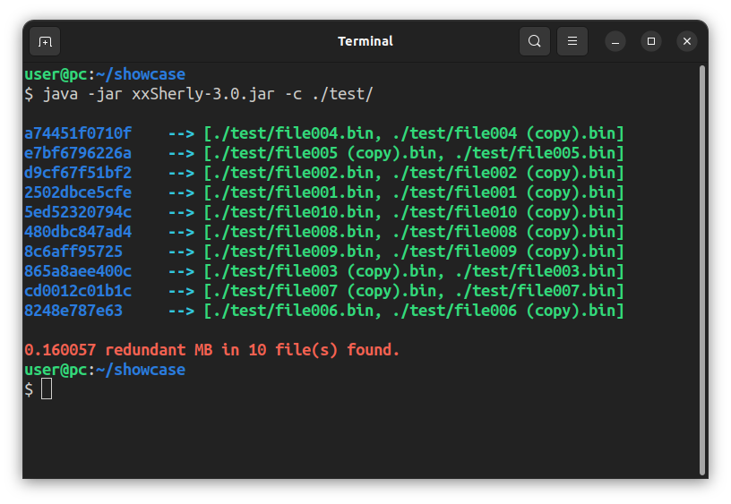

# xxSherly

A fork of [Sherly](https://github.com/BlyDoesCoding/Sherly), using [xxHash](https://github.com/Cyan4973/xxHash).  
This fork is faster, but has less features and may produce false-positives.



## Introduction

Sherly is a Multithreaded Duplicate File Finder for your Terminal, written in java. You can Easily find duplicate Images, videos as well as any other type of Data. That can be helpful if you run on small storage or just want to keep regular housekeeping.

Instead of md5, this fork uses [xxHash](https://github.com/Cyan4973/xxHash) + the filesize to find duplicates, for performance reasons (see [Speed comparison](#speed-comparison)).
Note that xxHash is not a cryptographic hash function and therefore may produce collisions (false-positives). For this reason, since version 2.1, the program no longer offers the option to delete duplicates. You should delete them by yourself.

## Usage

```
usage: xxSherly.jar [options] folder1 folder2 ...
 -c,--color     enable colored output
 -h,--help      show this help message
 -v,--verbose   more verbose output
```

## Build

```bash
mvn package assembly:single
```

## Supported Platforms

| OS                |    Working     | Version |
| ----------------- | :------------: | ------: |
| Linux             |      Yes       |     1.0 |
| Windows 10/11     | Not yet tested |       - |
| macOS             | Not yet tested |       - |
| BSD               | Not yet tested |       - |

## Speed comparison

I let Sherly and xxSherly find duplicates in my Music Library (containing `.wav` files) using the following commands:

```bash
# Sherly v1.1.4
time java -jar Bin/sherly.jar -n -f ~/Music/
# xxSherly v2.1
time java -jar target/xxSherly-2.1-jar-with-dependencies.jar ~/Music/
# xxSherly v3.0
time java -jar target/xxSherly-3.0-jar-with-dependencies.jar ~/Music/
```

The timings are measured using the Linux tool `time` (`real`).

|           | Sherly v1.1.4 | xxSherly v2.1 | xxSherly v3.0 |
| --------: | ------------: | ------------: | ------------: |
|  1st run  |        4.055s |        2.554s |        2.086s |
|  2nd run  |        4.055s |        2.554s |        2.109s |
|  3rd run  |        4.066s |        2.556s |        2.092s |
|  **avg**  |    **4.059s** |    **2.555s** |    **2.096s** |
